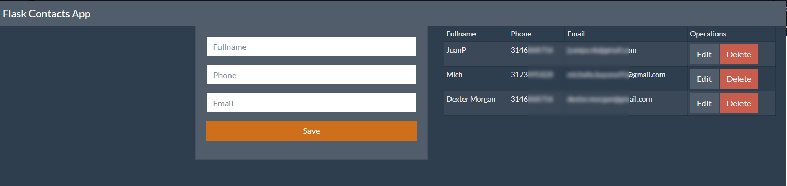

# Flask_contacts_app

Web application using Python and Flask, plus Mysql as a database. Basic contacts application, Using the CRUD operations (Create, Read, Update, Delete) 



### Prerequisites

The things you need before installing the software.

* Mysql

### Installation

A step by step guide that will tell you how to get the development environment up and running.

```
$ pip install flask
$ pip install flask-mysqldb
```
